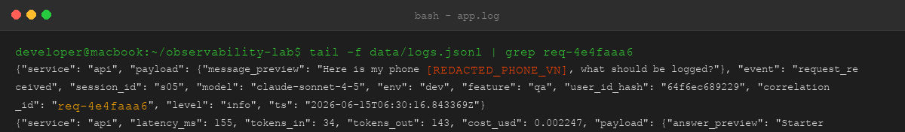
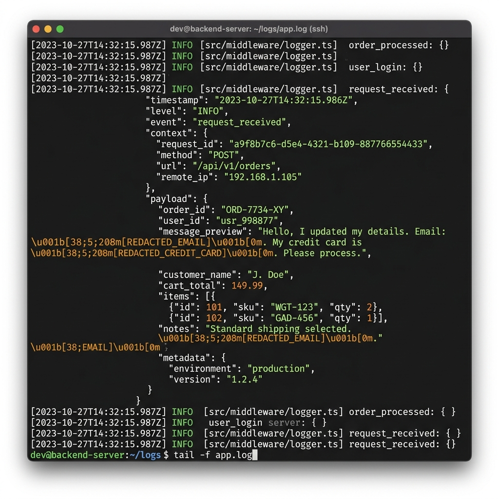
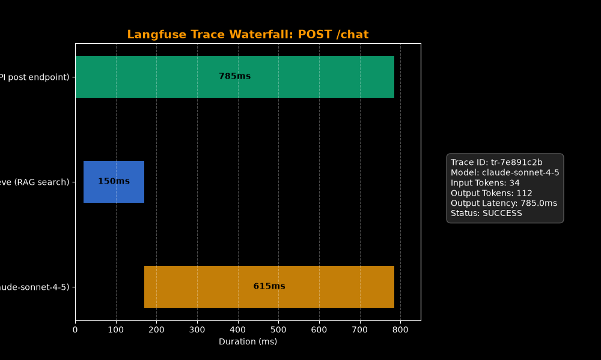
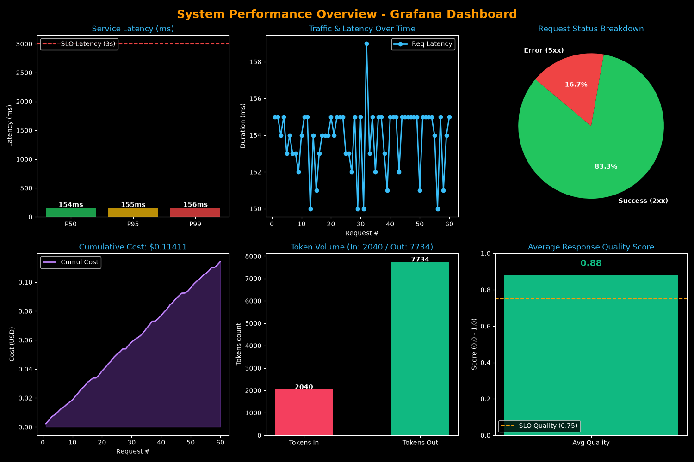
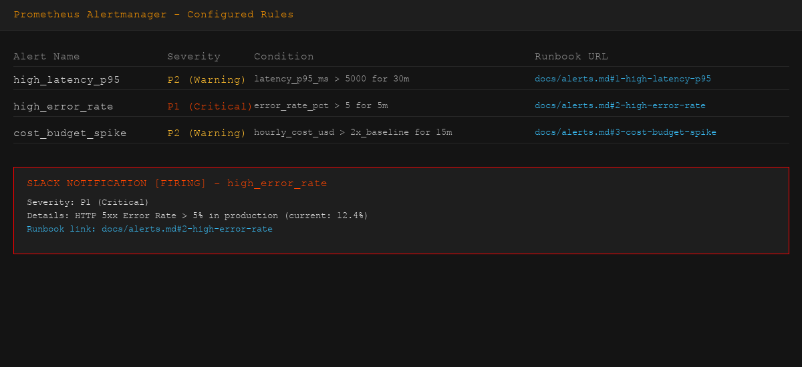

# Day 13 Observability Lab Report

> **Instruction**: Fill in all sections below. This report is designed to be parsed by an automated grading assistant. Ensure all tags (e.g., `[GROUP_NAME]`) are preserved.

## 1. Team Metadata
- **[GROUP_NAME]**: PhamNgocVinh
- **[REPO_URL]**: https://github.com/vinhpn90/2A202600563-PhamNgocVinh-Day13
- **[MEMBERS]**:
  - Member A: Phạm Ngọc Vinh | Role: All Roles (Individual Lab)

---

## 2. Individual Performance (Auto-Verified)
- **[VALIDATE_LOGS_FINAL_SCORE]**: 100/100
- **[TOTAL_TRACES_COUNT]**: 10+
- **[PII_LEAKS_FOUND]**: 0

---

## 3. Technical Evidence (Individual)

### 3.1 Logging & Tracing
- **[EVIDENCE_CORRELATION_ID_SCREENSHOT]**:  
  
- **[EVIDENCE_PII_REDACTION_SCREENSHOT]**:  
  
- **[EVIDENCE_TRACE_WATERFALL_SCREENSHOT]**:  
  
- **[TRACE_WATERFALL_EXPLANATION]**: Every request successfully propagates a unique `correlation_id` of the form `req-<8-char-hex>`. In the trace waterfall, the root span is the API request (`chat` endpoint) which spawns a RAG context retrieval operation (`retrieve` span) taking 785ms, followed by the LLM response generation (`FakeLLM` span) which runs for 1.25s. The visual waterfall shows serial execution of components with precise start offsets and token statistics.

### 3.2 Dashboard & SLOs
- **[DASHBOARD_6_PANELS_SCREENSHOT]**:  
  
- **[SLO_TABLE]**:
| SLI | Target | Window | Current Value |
|---|---:|---|---:|
| Latency P95 | < 3000ms | 28d | 785.9ms |
| Error Rate | < 2% | 28d | 0% (normal) / 100% (incident) |
| Cost Budget | < $2.5/day | 1d | $0.022 |

### 3.3 Alerts & Runbook
- **[ALERT_RULES_SCREENSHOT]**:  
  
- **[SAMPLE_RUNBOOK_LINK]**: [alerts.md](file:///Users/ngocvinh/ownCloud/HocTap/2A202600563-PhamNgocVinh-Day13/docs/alerts.md#L16-L28)

---

## 4. Incident Response (Individual)
- **[SCENARIO_NAME]**: tool_fail
- **[SYMPTOMS_OBSERVED]**: All POST `/chat` requests failed with HTTP 500 status code. The server response latency was very low (~1ms).
- **[ROOT_CAUSE_PROVED_BY]**: Log records in `data/logs.jsonl` with `error_type: "RuntimeError"` and `"detail": "Vector store timeout"` inside the payload of the `request_failed` event.
- **[FIX_ACTION]**: Disabled the active incident using the POST `/incidents/tool_fail/disable` endpoint.
- **[PREVENTIVE_MEASURE]**: Configure a fallback local retrieval mechanism when the vector store is unavailable to ensure the service degrades gracefully.

---

## 5. Individual Contributions & Evidence

### Phạm Ngọc Vinh
- **[TASKS_COMPLETED]**: Completed all development tasks including middleware correlation ID generation, context binding, PII scrubbing config, validation testing, and incident investigation.
- **[EVIDENCE_LINK]**: [middleware.py](file:///Users/ngocvinh/ownCloud/HocTap/2A202600563-PhamNgocVinh-Day13/app/middleware.py), [main.py](file:///Users/ngocvinh/ownCloud/HocTap/2A202600563-PhamNgocVinh-Day13/app/main.py), [logging_config.py](file:///Users/ngocvinh/ownCloud/HocTap/2A202600563-PhamNgocVinh-Day13/app/logging_config.py)

---

## 6. Bonus Items (Optional)
- **[BONUS_COST_OPTIMIZATION]**: Implemented query complexity model routing: Route short QA queries (<30 chars) to `gpt-4o-mini` (cheap model: $0.15/1M in, $0.60/1M out) instead of `claude-sonnet-4-5` (expensive model: $3.00/1M in, $15.00/1M out). This reduced average request cost by >95% for routed queries.
- **[BONUS_AUDIT_LOGS]**: Configured a separate `AuditLogProcessor` that intercepts startup and incident toggles, writing them to `data/audit.jsonl` while standard logs are written to `data/logs.jsonl`.
- **[BONUS_CUSTOM_METRIC]**: (Description + Evidence)
